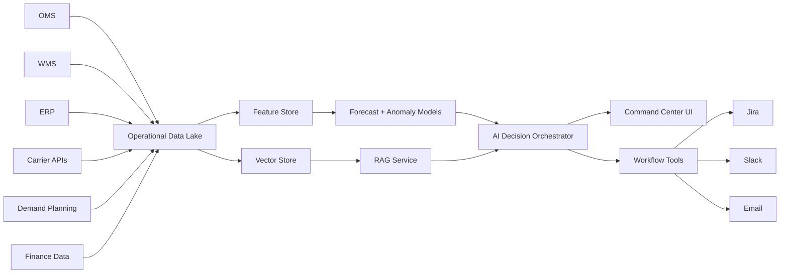

# AI Architecture

## System overview

## Data sources
- Order management system
- Warehouse management system
- Enterprise resource planning system
- Carrier tracking and SLA data
- Demand planning forecasts
- Inventory positions
- Finance and margin data
- Customer support tickets

## AI components

### 1. Anomaly detection
Detects unexpected movement in OTIF, cost/order, fulfillment cycle time, pick rates, and carrier scan rates.

### 2. Retrieval-augmented generation
Retrieves relevant context from operational docs, historical incidents, SOPs, forecast commentary, and customer policies.

### 3. Root-cause analysis
Combines time-series signals, operational events, and retrieved context to explain probable drivers.

### 4. Scenario simulation
Models the expected impact of actions such as rerouting orders, reducing safety stock, adjusting promotional demand, or changing carrier mix.

### 5. Confidence scoring
Each recommendation receives confidence based on data completeness, historical similarity, model agreement, and business rule validation.

### 6. Human-in-the-loop approval
AI can recommend, draft, and prepare workflow actions, but high-impact changes require human approval.

## Guardrails
- No autonomous execution for inventory transfers, carrier changes, or customer communication in V1.
- Low-confidence recommendations are routed to analyst review.
- All AI-generated recommendations include source traceability.
- Financial impact estimates are labeled as modeled, not guaranteed.
- Audit trail is retained for every recommendation and decision.

## Evaluation approach
- Recommendation acceptance rate
- Root-cause accuracy after postmortem
- Forecast error reduction
- False positive alert rate
- Time to detect incident
- Time to resolution
- User trust score
